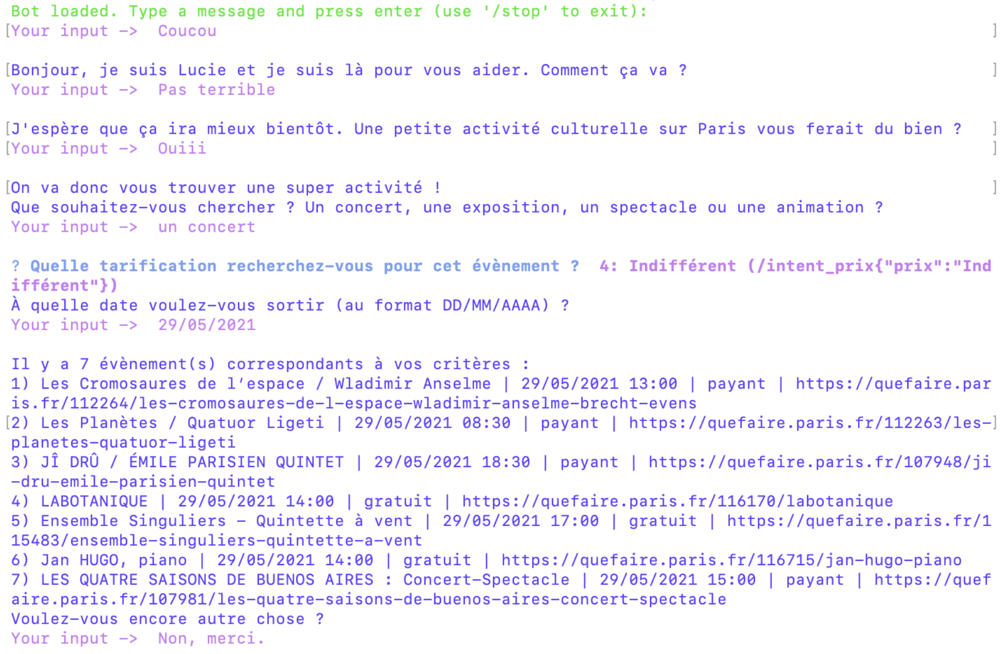

## Rasa-NLU chatbot Lucie 🤖 (event finder in Paris)

Dans le cadre du cours Extraction d’informations en Master 1 Traitement Automatique des Langues, nous avons développé un chatbot avec [l’outil open-source Rasa](https://rasa.com/).

Ce chatbot utilise des actions customisées pour rechercher les événements correspondants aux critères de recherche de l’utilisateur via l'API du [site Open Data de la ville de Paris](https://opendata.paris.fr/page/home/) (282 jeux de données proposés).

Le chatbot a été élaboré avec la version Rasa 2.6, il est donc conseillé de le tester avec cette même version. Il est possible de lancer le chatbot avec le modèle fourni via les commandes suivantes : ```rasa run actions```, ```rasa shell```.


**NB:** Ces deux commandes doivent être lancées dans deux terminaux parallèles. La première commande est utilisée seulement dans les cas d’utilisation des actions customisées.

Il est possible d'entraîner le nouveau modèle via : ```rasa train```.

Pour consulter toute la liste des commandes RASA disponibles : ```rasa -h```.


Voici l'exemple d'un dialogue avec Lucie :
  
